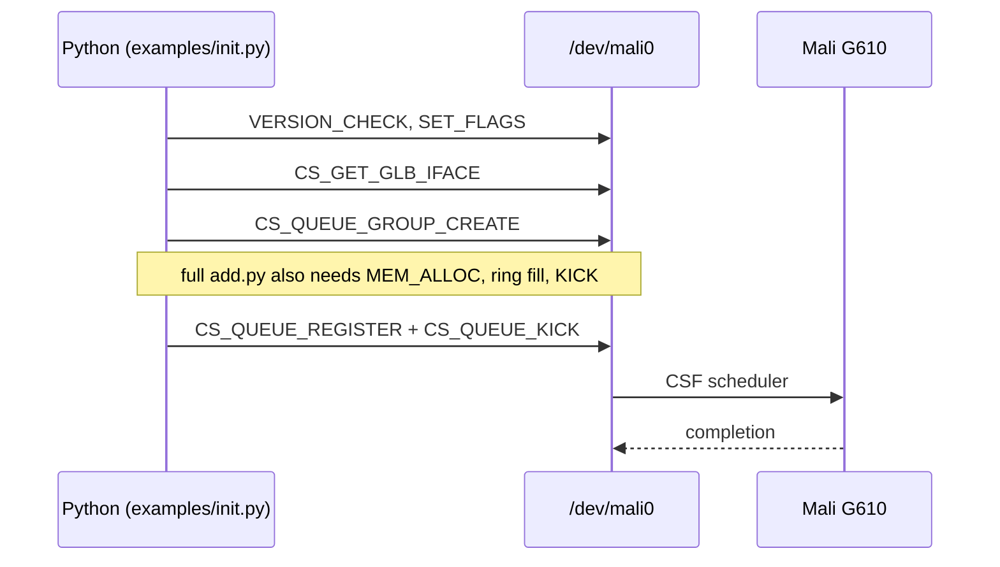

# rk3588gpu

Pure Python Mali GPU bring-up on RK3588 — no libmali, no Mesa in the hot path.
Same idea as [allbilly/applegpu](https://github.com/allbilly/applegpu) `examples/add.py`: open the device, issue ioctls, submit work.

See **[gpt-deepresearch.md](gpt-deepresearch.md)** for the full porting report (Apple `add.py` → Mali, Panfrost vs proprietary stack, ioctl mapping tables, setup prerequisites).

## Two Mali stacks on RK3588

| Stack | Device node | UAPI | This repo |
|-------|-------------|------|-----------|
| **Panfrost / Panthor** (Mesa, open source) | `/dev/dri/renderD128` | `drm/panfrost_drm.h` — `CREATE_BO`, `MMAP_BO`, `SUBMIT`, `WAIT_BO` | Not implemented here; see `gpt-deepresearch.md` § *direct_add.py* |
| **Proprietary kbase** (Rockchip BSP) | `/dev/mali0` | `mali_kbase_csf_ioctl.h` — CSF ioctls | **Implemented** — capture, replay, examples |

On many RK3588 boards (including Orange Pi with the vendor `mali` module), **`/dev/mali0` is the GPU** and `renderD128` is the display subsystem, not Panfrost. The research doc notes:

> *If instead using Rockchip's proprietary driver, the Python IOCTLs above will not work; one would then use the `/dev/mali0` interface.*

This repository is that `/dev/mali0` path.

## Apple add.py → kbase (this repo)

From [gpt-deepresearch.md](gpt-deepresearch.md) § *Apple vs Mali IOCTL/Buffers Mapping*, adapted for the proprietary CSF driver:

| **add.py step** | **Apple (Asahi)** | **RK3588 kbase (this repo)** |
|-----------------|-------------------|------------------------------|
| Open device | `open("/dev/dri/cardX")` | `open("/dev/mali0")` — `kbase_dev.KbaseDevice` |
| Version / context | IOKit / AGX setup | `KBASE_IOCTL_VERSION_CHECK`, `KBASE_IOCTL_SET_FLAGS` |
| Query caps | AGX params | `KBASE_IOCTL_CS_GET_GLB_IFACE` |
| Queue setup | AGX queue create | `KBASE_IOCTL_CS_QUEUE_GROUP_CREATE`, `CS_QUEUE_REGISTER`, `CS_QUEUE_BIND` |
| Allocate GPU memory | GEM / UAO alloc | `KBASE_IOCTL_MEM_ALLOC` / `MEM_ALLOC_EX` |
| Upload inputs | mmap + write | mmap via bind handle, or GEM blob in `.mcap` |
| Build command stream | Metal / AGX shader bytes | Mali CSF ring (`cs_disasm.py`) |
| Submit | `AGX_SUBMIT` | `KBASE_IOCTL_CS_QUEUE_KICK` |
| Wait | fence / `AGX_WAIT` | `KBASE_IOCTL_CS_EVENT_SIGNAL` + kick completion |
| Replay captured trace | `.cap` + `replay.py` | `.mcap` + `replay.py` |

Flow (kbase path):



## Layout

```
kbase_ioctl.py    # ioctl numbers + ctypes unions (CSF UK 1.14)
kbase_dev.py      # open /dev/mali0, ioctl helpers
cap_format.py     # .mcap binary format
cap_decode.py     # named struct decode for dumps
replay.py         # replay captures (dry-run or live)
cs_disasm.py      # CSF command stream disassembler
capture/          # LD_PRELOAD interposer → .mcap
examples/
  add.py          # vector add workload (applegpu-shaped; partial on BSP)
  init.py         # minimal live GPU init (VERSION_CHECK → queue group)
tools/mcap.py     # synthesize test captures
```

## Quick start

```bash
make test-dry     # parse synthetic capture (any host)
make test-live    # send real ioctls to /dev/mali0 (needs video group)
make capture APP=./your_gles_app CAP=foo.mcap   # record ioctls from libmali app
python3 replay.py foo.mcap --dry-run            # inspect
python3 replay.py foo.mcap                      # replay on GPU
```

Permissions: user must be in the `video` group (or root) for `/dev/mali0`.

## References

```
blog  https://icecream95.gitlab.io/mali-g610-reverse-engineering-part-1.html
      … parts 2–4

mesa  https://docs.mesa3d.org/drivers/panfrost.html
      panfrost GL  https://gitlab.freedesktop.org/mesa/mesa/-/tree/main/src/gallium/drivers/panfrost
      panvk        https://gitlab.freedesktop.org/mesa/mesa/-/tree/main/src/panfrost/vulkan

uapi  panfrost     https://github.com/torvalds/linux/blob/master/include/uapi/drm/panfrost_drm.h
      panfrost drm https://dri.freedesktop.org/docs/drm/gpu/panfrost.html

rk3588 / panthor
      https://www.phoronix.com/news/Panthor-DRM-Newer-Mali
      https://www.collabora.com/news-and-blog/news-and-events/from-panthor-to-rk3588-advancing-graphics-video-and-soc-support-linux-kernel-7.html

methodology (applegpu mental model)
      https://asahilinux.org/2023/03/road-to-vulkan/
      https://github.com/allbilly/applegpu
```
