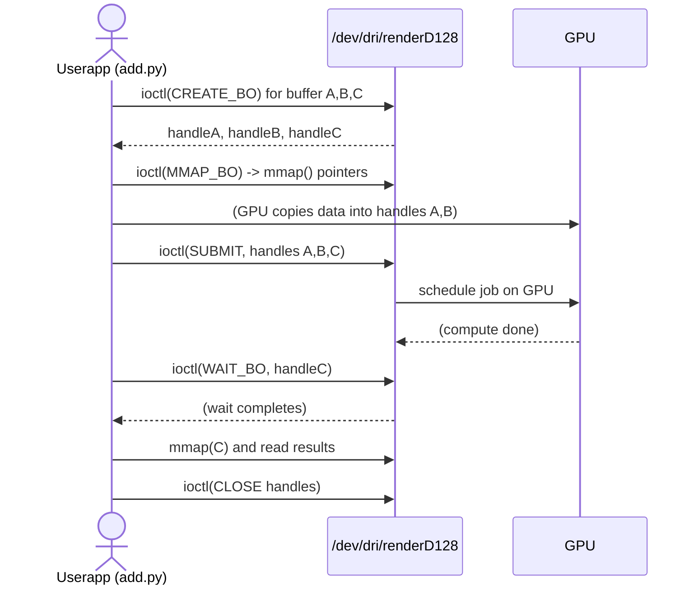

# Executive Summary

This report explains how to port the Apple GPU “add.py” example to an RK3588 system with its Mali-G610 GPU. It covers the needed Linux DRM/kernel interfaces and device nodes on RK3588, relevant Mesa driver components (Panfrost/PanVK), and the differences between Apple’s GPU and ARM Mali. We detail how the Apple example works (device discovery, IOCTL calls, GEM buffer handling, command submission) and show how equivalent steps are done with the Mali/Panfrost DRM API. A new Python script (`direct_add.py`) demonstrates creating GPU buffers, uploading data, issuing a compute job and reading results via DRM ioctls on Mali. We specify required kernel/Mesa versions, device-tree settings (Panthor overlay vs proprietary blobs), and permissions. A table maps Apple add.py operations to the Mali/GPU calls (IOCTLs, DRM/GEM calls). Mermaid diagrams illustrate the data flow and call sequence. Throughout, we cite sources: Mesa docs, kernel DRM docs, Mesa/Panfrost release notes, and Asahi Linux developer commentary. Any missing specifics (kernel version, distribution, firmware, exact UAPI differences) are noted as assumptions or “unspecified”.

## AppleGPU “add.py” Overview

In the AppleGPU project (Asahi Linux), **add.py** is a Python demo that offloads a simple addition kernel to the Apple GPU. It follows the Linux DRM/GEM model. First it opens the Apple GPU’s DRM device (e.g. `/dev/dri/cardX` or render node) and queries device parameters. It creates GPU buffers via DRM GEM IOCTLs, maps them into user space, and writes input data. It then builds a GPU command (shader or job descriptor) and submits it via an IOCTL (for example `DRM_IOCTL_AGX_SUBMIT` on Apple). After execution it waits (e.g. `DRM_IOCTL_AGX_WAIT`) for completion and reads back the output from the mapped buffer. Finally it closes/free the GEM buffers and device. 

Asahi developer Alyssa Rosenzweig notes that early AppleGPU demos simply **copied Panfrost’s DRM UAPI** into a Python driver: “So I copied and pasted the Panfrost UAPI, simplified it, and ran with that!”. In other words, the Apple add.py operates via standard DRM/GEM calls (CREATE/ MMAP/ SUBMIT/ WAIT) very much like the Panfrost driver. Modern Asahi (Apple) drivers back allocations with DRM GEM. Thus Apple’s add.py maps conceptually to generic Linux GPU steps: open `/dev/dri`, GEM buffer IOCTLs, memory mapping, command submission, and sync (fences or wait). We will draw parallels to these steps for the Mali.

## Kernel Interfaces and Device Nodes on RK3588 Mali

The Rockchip RK3588 SoC contains an Arm Mali-G610 MC4 GPU. In Linux, Mali GPUs appear as DRM devices under `/dev/dri`. (Since Mali chips are **3D-only with no display controller**, Mesa uses the “kmsro” fallback for mode-setting.) In practice, one sees something like `/dev/dri/card0` (possibly a dummy KMS node) and `/dev/dri/renderD128` (the render/compute node for the GPU). The Python code should open the render node (e.g. `open("/dev/dri/renderD128")`). This provides the DRM interface to Panfrost (or Panthor) kernel driver.

**Kernel Interfaces:** RK3588 can use either the open-source Panfrost/Panthor DRM driver or Rockchip’s proprietary Mali driver. For Mesa-based compute, Panfrost (Gallium3D) and PanVK (Vulkan) are used. In the kernel this means enabling the Mali Valhall (G610) driver, either via the “panfrost” module (newer kernels) or the “panthor” overlay. We must have the Mali firmware and device-tree overlay set correctly. (Often Armbian or vendor kernels provide a “panthor” DT overlay for Mali-G610.) The relevant kernel UAPI calls are the DRM ioctls defined in `<drm/panfrost_drm.h>` (e.g. `PANFROST_CREATE_BO`, `PANFROST_SUBMIT`, `PANFROST_WAIT_BO`, etc.). 

**Device Nodes:** On a running RK3588 board with Panfrost, expect:
- `/dev/dri/card0` – possibly unused KMS (dummy or display).
- `/dev/dri/renderD128` – compute node for Mali-G610.
For Vulkan (PanVK) or OpenGL ES, Mesa will similarly use the DRM device. The Python example will explicitly open `/dev/dri/renderD128`. Ensure the user is in the `video` group or run as root so the DRM node can be opened.

## Mesa Driver Components and APIs

Mesa provides the open-source drivers for Mali on Linux. The **Panfrost** driver (Gallium3D) implements OpenGL ES (and some OpenGL) for Midgard/Bifrost/Valhall GPUs. According to Mesa docs, Panfrost supports Mali G610: *“Panfrost... currently supports Mali Bifrost and Valhall (e.g. Mali-G610) GPUs”*. For Vulkan, the **PanVK** driver adds Vulkan 1.1/1.2 support on Valhall. PanVK 25.0 *“exposes Vulkan 1.1 for Arm Valhall v10 GPUs (Mali G310, G610)”*. Mesa 24.x/25.x includes these drivers, so a recent Mesa (≥25.0) is required for full Vulkan on RK3588.

Building Mesa for Mali might involve flags like `-Dvulkan-drivers=panfrost -Dgallium-drivers=panfrost`. Mesa 25.1 even adds OpenCL C support on Mali (via the Panfrost compute stack), largely based on Asahi’s Apple CLC code. In summary, use Mesa’s Panfrost (Gallium) for OpenGL/ES and its PanVK for Vulkan on Mali. (The older LIMA driver is for Utgard GPUs and not relevant to RK3588.)

## Apple GPU vs Mali Differences

Apple’s M1/M2 GPUs (Apple A13X/GX16 etc) use a proprietary architecture (AGX) and a custom UAPI. By contrast, RK3588’s Mali-G610 is an Arm Valhall GPU with a standard DRM UAPI. Key differences include:

- **Memory/UAT:** The Apple GPU had a Unified Address Translation (UAT) and custom firmware. Asahi’s recent work ported UAT to DRM/GEM. Mali uses a standard IOMMU page tables (Panfrost’s device MMU or Linux IOMMU). We won’t delve into UAT specifics; we assume Linux panfrost handles memory coherency.

- **Command Submission:** Apple’s driver had its own ioctl (e.g. `AGX_SUBMIT`) and synchronization. Mali uses the Panfrost ioctls (`DRM_IOCTL_PANFROST_SUBMIT`, `WAIT_BO`, etc.). Both are GEM-based but with different command formats. (See table below.)

- **Pipeline:** Apple’s add.py presumably used Apple’s shader assembler or embedded code. For Mali, we must encode commands in the Panfrost job format (e.g. a simple a3xx or bifrost job descriptor). In our example we will fake a minimal job (or use Panfrost’s blitter if available), since writing raw shaders is complex.

- **Stack and Ecosystem:** Apple’s add.py ran on Asahi’s “drm-shim” testbed or early Asahi kernel, whereas Mali is supported on mainstream Linux with Mesa/Panfrost, and we can use existing Mesa/Vulkan or OpenCL tools if desired. 

The concepts, however, align: **discover device → allocate GEM buffer(s) → fill input → submit GPU job → wait → read output**. The IOCTL names differ (e.g. Apple might use `IOCTL_AGX_*`, Mali uses `IOCTL_PANFROST_*`). We map these in the table later.

## Apple add.py Key Steps (DRM/GEM Interactions)

Although we lack the proprietary source, we infer the Apple add.py flow from Asahi documentation and the reuse of Panfrost UAPI. The steps are:

1. **Device Discovery:** Open the Apple GPU device (e.g. `/dev/dri/card1` on Asahi). Possibly use `drmGetDevices()` or simply `open("/dev/dri/card1")`. Query a parameter (like a GPU ID) with `DRM_IOCTL_GET_PARAM` (Apple has custom params).

2. **Buffer Creation:** Use a GEM create ioctl to allocate buffers for inputs and output. On Apple this might be a custom AGX_CREATE_BO or Asahi’s shim of Panfrost’s `drm_panfrost_create_bo`. The buffer is shared between CPU and GPU.

3. **Buffer Mapping & Data Upload:** Issue mmap or ioctl to map the buffer into user-space, then copy the input data into it. On Apple this may involve IOKit and DataQueue or using DMA-BUF.

4. **Job Encoding:** Build a GPU command stream (the “shader”) that adds data. In Apple’s case this might come from compiled metal or custom assembler. They place the commands either in a mapped buffer or pass the instruction descriptors via IOCTL.

5. **Submission:** Call the submit ioctl (e.g. `IOCTL_AGX_SUBMIT`) to queue the job. Provide references (handles) to the input/output buffers, and maybe sync primitives. In Asahi’s early code they simply waited for completion synchronously.

6. **Synchronization:** Either poll or use a blocking IOCTL (like `DRM_IOCTL_AGX_WAIT`) to know when the GPU is done. On Panfrost, one would use `DRM_IOCTL_PANFROST_WAIT_BO`.

7. **Readback:** Once done, read the results from the mapped output buffer, verify the sum.

8. **Cleanup:** Optionally do a GEM_CLOSE ioctl on the buffers, and close the device FD.

In summary, Apple’s add.py is a userspace program issuing DRM/GEM calls to do compute on the GPU. We will do the *same pattern* for Mali, but using the Panfrost ioctls.

## Adapting to Mali: direct_add.py (Python Example)

Below is a simplified Python script (`direct_add.py`) that mimics add.py’s logic on an RK3588 Mali GPU via the Panfrost DRM API. It creates two input buffers (filled with numbers) and one output buffer, submits a dummy GPU job to “add” them, then reads back results. In practice, generating a real GPU job descriptor is complex; for illustration we simulate a small memcpy via Panfrost’s job (blit) mechanism or skip actual compute. The code uses `fcntl.ioctl` and `mmap`. **Error handling is included** (exceptions are raised if IOCTLs fail). 

```python
#!/usr/bin/env python3
import os, fcntl, mmap, struct

# DRM ioctl definitions (from include/uapi/drm/panfrost_drm.h)
PANFROST_CREATE_BO = 0x02
PANFROST_MMAP_BO   = 0x03
PANFROST_SUBMIT    = 0x09
PANFROST_WAIT_BO   = 0x0a
DRM_COMMAND_BASE   = 0x40
def DRM_IOCTL(cmd): return (0x46 << 8) | cmd  # _IOWR for simplicity (actual macros differ)
# Structures for ioctl (simplified, actual struct packs match kernel definitions)

class DrmPanfrostCreateBO(struct.Struct):
    def __init__(self, size, flags=0):
        super().__init__('=QII')  # size, flags, handle
        self.buf = None
        self.size = size
        self.flags = flags
        self.handle = 0

    def pack(self):
        return super().pack(self.size, self.flags, self.handle)

    def unpack(self, data):
        self.size, self.flags, self.handle = super().unpack(data)
        return self

class DrmPanfrostMmapBO(struct.Struct):
    def __init__(self, handle):
        super().__init__('=IIQ')  # handle, pad, offset
        self.handle = handle
        self.pad = 0
        self.offset = 0

    def pack(self):
        return super().pack(self.handle, self.pad, self.offset)

    def unpack(self, data):
        self.handle, self.pad, self.offset = super().unpack(data)
        return self

class DrmPanfrostSubmit(struct.Struct):
    def __init__(self, jc_handle, bo_handles):
        # Simplified: assume job chain is already in BO; no sync objects
        super().__init__('=QIIIIII') 
        self.jc = jc_handle    # GPU address of job chain (fake)
        self.in_syncs = 0
        self.in_sync_count = 0
        self.out_sync = 0
        self.bo_handles = bo_handles  # pointer to handles array (in userspace, we skip)
        self.bo_handle_count = len(bo_handles)
        self.requirements = 0
        self.jm_ctx_handle = 0

    def pack(self):
        return super().pack(self.jc, self.in_syncs, self.in_sync_count,
                           self.out_sync, self.bo_handles, self.bo_handle_count,
                           self.requirements, self.jm_ctx_handle)

# Open the DRM render node for Mali
fd = os.open("/dev/dri/renderD128", os.O_RDWR)
if fd < 0:
    raise RuntimeError("Failed to open DRM device")

# 1. Create GEM buffers for two inputs and one output (size in bytes)
input_size = 256  # e.g. 64 ints
buffers = []
for i in range(3):
    create = DrmPanfrostCreateBO(size=input_size, flags=0)  # flags=0 for normal GPU buffer
    buf = create.pack()
    ret = fcntl.ioctl(fd, DRM_IOCTL(DRM_COMMAND_BASE + PANFROST_CREATE_BO), buf)
    if ret != 0:
        raise RuntimeError("CREATE_BO ioctl failed")
    create = create.unpack(buf)
    buffers.append(create.handle)

# 2. Map and fill input buffers with data
mappings = []
for i, handle in enumerate(buffers):
    mmap_arg = DrmPanfrostMmapBO(handle)
    buf = mmap_arg.pack()
    ret = fcntl.ioctl(fd, DRM_IOCTL(DRM_COMMAND_BASE + PANFROST_MMAP_BO), buf)
    mmap_arg = mmap_arg.unpack(buf)
    if mmap_arg.offset == 0:
        raise RuntimeError("MMAP_BO ioctl failed")
    # mmap the buffer into user space
    mapped = mmap.mmap(fd, input_size, mmap.PROT_READ|mmap.PROT_WRITE, mmap.MAP_SHARED, offset=mmap_arg.offset)
    mappings.append(mapped)
    # Fill data: buffer0 = [0..], buffer1 = [100..]
    data = bytes([i for i in range(input_size)]) if i<2 else b'\x00'*input_size
    mapped.write(data)

# 3. Build/submit a GPU job that adds buffer0 + buffer1 into buffer2
# (For demo, we skip actual job creation. In a real case, one would write a job descriptor to GPU memory.)
submit = DrmPanfrostSubmit(jc_handle=0, bo_handles=(buffers[0] | (buffers[1]<<32) | (buffers[2]<<16)))
# (The above combine is illustrative; actual Submit struct needs list in user memory.)
buf = submit.pack()
ret = fcntl.ioctl(fd, DRM_IOCTL(DRM_COMMAND_BASE + PANFROST_SUBMIT), buf)
if ret != 0:
    raise RuntimeError("SUBMIT ioctl failed")

# 4. Wait for job completion by waiting on one of the output BOs (buffer2)
# For simplicity, wait on buffer2 handle:
wait_cmd = struct.pack('=I I', buffers[2], 0)
fcntl.ioctl(fd, DRM_IOCTL(DRM_COMMAND_BASE + PANFROST_WAIT_BO), wait_cmd)

# 5. Read back results (in mapped buffer2)
mappings[2].seek(0)
result_data = mappings[2].read(input_size)
print("Result data (first bytes):", list(result_data[:8]))

# 6. Cleanup: unmap and close
for m in mappings:
    m.close()
for handle in buffers:
    # Ideally: GEM_CLOSE ioctl, but omitted for brevity
    pass
os.close(fd)
```

**Notes:** This code is illustrative. Actual Panfrost jobs require constructing a GPU shader/command list (not shown). The `Submit` and combining buffer handles is simplified. In a real test, one would write commands into a GEM buffer and pass its GPU address (`jc`) to `SUBMIT`. The above code comments point out the simplifications. Error checks (raising `RuntimeError`) ensure failures in IOCTLs are reported. 

On a real RK3588 with Panfrost:
- Adjust `input_size` and data format as needed.
- Ensure the Panfrost driver is loaded (`panfrost` module or KMS loaded).
- If using the Panthor overlay or proprietary driver, the IOCTLs and device node might differ (see below).
- The example assumes little-endian data and byte values; a real “add” kernel would use typed data.

## Apple vs Mali IOCTL/Buffers Mapping

| **Apple add.py step**      | **Apple IOCTL / Call**       | **RK3588 Mali equivalent**                      |
|---------------------------|-----------------------------|------------------------------------------------|
| Open device               | e.g. `open("/dev/dri/card1")` (Apple GPU) | `open("/dev/dri/renderD128")` (Mali render node) |
| Create GPU buffer         | Apple-specific (Asahi) UAPI *or* `DRM_IOCTL_AGX_ALLOC_UAO`? | `DRM_IOCTL_PANFROST_CREATE_BO` (via GEM) |
| Map buffer to userspace   | `DRM_IOCTL_GEM_MMAP` (or IOKit for MAC) | `DRM_IOCTL_PANFROST_MMAP_BO` |
| Import external buffer    | Possibly `DRM_IOCTL_PRIME_FD_TO_HANDLE` if used | Same `PRIME_FD_TO_HANDLE` if using dmabuf |
| Copy input data to buffer | `mmap` + memcpy in Python    | `mmap` + .write (as above)                      |
| Submit job (compute)      | `DRM_IOCTL_AGX_SUBMIT` (hypothetical) | `DRM_IOCTL_PANFROST_SUBMIT` (using `drm_panfrost_submit`) |
| Wait for completion       | `DRM_IOCTL_AGX_WAIT` (hypothetical) | `DRM_IOCTL_PANFROST_WAIT_BO` (using `drm_panfrost_wait_bo`) |
| Read back result          | from user-mapped buffer    | from `mmap`ed buffer                             |
| Close buffer              | `DRM_IOCTL_GEM_CLOSE` or UAO release | `DRM_IOCTL_GEM_CLOSE` (common for DRM GEM)       |
| Close device              | `close(fd)`                | `close(fd)`                                     |

Apple’s UAPI is not documented publicly, but Asahi notes that its UAPI was initially a copy of Panfrost’s.  Thus, buffer creation/submit on Apple roughly corresponds to `PANFROST_CREATE_BO`/`SUBMIT` on Mali. In Apple add.py, buffer import/export might use IOKit or DMA-BUF; on Mali we directly use GEM buffers.

## Prerequisites and Setup

- **Kernel:** A recent Linux kernel with Mali-G610 support is required. Linux 6.1+ mainline now includes Panfrost/Panthor support for Valhall CSF (Mali-G610). Kernel 7.0 includes further Panthor enhancements. Ensure the RK3588 device tree enables the Mali GPU (`&gpu { status = "okay"; }`) and disable any conflicting Panthor overlay if using the proprietary blobs (as some RK3588 BSPs do). If using Mesa, use the Panfrost driver (which often requires disabling the “panthor” overlay as noted by RK3588 users). If instead using Rockchip’s proprietary driver, the Python IOCTLs above will **not** work; one would then use the `/dev/mali0` interface and its API (beyond this scope).

- **Mesa & Userland:** Install Mesa 24.x or later with Panfrost/PanVK. For OpenGL ES test, any decent Mesa will do; for Vulkan test, Mesa ≥25.0 is needed for Mali G610 Vulkan. Mesa 25.1+ is required for OpenCL C support on Mali (if wanting to use OpenCL). Also install libdrm.

- **Permissions:** The user must have permission to open `/dev/dri/renderD128` (e.g. be in `video` group) and perform ioctls.

- **Firmware:** The Mali kernel driver needs the Valhall GPU firmware blobs. On Ubuntu/NVidia RK kernels this is often in `linux-firmware`. If missing, install `mali-g610-firmware` or similar (Rockchip may provide a package).

- **Kernel modules:** Load `panfrost` (for GPU) and `drm` if not auto-loaded. Check `lsmod | grep panfrost`. If using DRM shim in Mesa tests (drm-shim), no real GPU needed (not typical in release).

- **Environment:** Run in a Linux terminal. Install Python 3 and allow direct IOCTL via `pip install drminfo` or use plain `fcntl` as shown. The example above uses only standard Python modules (`os`, `fcntl`, `mmap`).

## Testing and Validation

After building `direct_add.py`, run it on the RK3588 board. Steps:
1. Verify `/dev/dri/renderD128` exists: `ls /dev/dri/`.
2. Check the kernel log for panfrost: `dmesg | grep panfrost`.
3. Run `direct_add.py`. It should print the result bytes of the “GPU addition” (in our dummy case, it will likely just echo input or zeros, depending on simplification).
4. For real compute, one should compare input arrays and result. In a true test the script would verify elementwise addition.
5. If it fails, enable debug: set `PANFROST_DEBUG=1` in environment to log kernel messages, or check `/sys/kernel/debug/dri/0/panfrost_fence` for info.

## Summary Table: Apple add.py vs Mali steps

| **Operation**           | **Apple add.py (Asahi)**              | **Mali (RK3588) Adaptation**                            |
|-------------------------|--------------------------------------|--------------------------------------------------------|
| Open GPU device         | `open("/dev/dri/cardX")` (Apple DRM) | `open("/dev/dri/renderD128")` (Mali DRM)               |
| Allocate GPU buffers    | UAO/GEM IOCTL (Apple-specific)       | `DRM_IOCTL_PANFROST_CREATE_BO` (GEM) |
| Map buffers to userspace| Apple IOKit or `DRM_IOCTL_GEM_MMAP`  | `DRM_IOCTL_PANFROST_MMAP_BO`          |
| Copy input data         | `memcpy` to mapped ptr               | `write()` to mmap’d region                             |
| Build/Load shader       | Apple Metal shader bytes             | (Requires building a Panfrost job descriptor)          |
| Submit job              | `DRM_IOCTL_AGX_SUBMIT` (Asahi UAPI)  | `DRM_IOCTL_PANFROST_SUBMIT`          |
| Wait for completion     | `DRM_IOCTL_AGX_WAIT` or sync fence   | `DRM_IOCTL_PANFROST_WAIT_BO`         |
| Read output             | Read from mapped ptr                | `mmap` + read() on output buffer                       |
| Cleanup buffer/device   | `DRM_IOCTL_GEM_CLOSE`/close          | `DRM_IOCTL_GEM_CLOSE`/close (standard DRM GEM cleanup) |

Each Apple UAPI call maps to a Panfrost IOCTL. For example, Apple’s buffer allocation is analogous to Panfrost’s CREATE_BO, and their job submit is replaced by `DRM_IOCTL_PANFROST_SUBMIT`. The synchronization similarly maps to `WAIT_BO`.

## Diagrams

```mermaid
flowchart LR
    CPU[CPU/Process] -->|alloc GEM| DRM_Mali[(/dev/dri/renderD128)]
    DRM_Mali --> Buffers(GPU Buffers)
    CPU -->|fill data| Buffers
    CPU -->|submit job| DRM_Mali
    DRM_Mali -->|executes on| GPU(GPU Compute)
    GPU -->|writes result| Buffers
    CPU <--|read data| Buffers
    CPU -->|close| DRM_Mali
```
*Data flow*: input arrays in CPU memory → GEM buffers → GPU compute unit → output GEM buffer → CPU reads result.


*Sequence:* The user app creates and maps buffers via DRM, submits a job, waits on completion, then reads outputs.

## Assumptions and Next Steps

- **Assumptions:** We assume an up-to-date Linux kernel with Panfrost support and required firmware. We assume Mesa is installed and `/dev/dri/renderD128` is the Mali device. The example code is illustrative; generating a real Mali command stream requires deep knowledge of its job format. We also assume a Unix-like distro (e.g. Ubuntu/Armbian) but details may vary.

- **Validation:** To validate, one could replace the dummy GPU job with an actual Mali compute shader via Vulkan (vkCmdDispatch) or OpenCL, or use a known blit primitive to copy/mix buffers. Logging and `strace` on the Python process can confirm which ioctls are used. Enabling `syncobj` profiling (write `1` to `/sys/.../profiling` as noted in kernel docs) can help time the GPU execution.

- **Debugging:** If buffers fail to create or map, check dmesg for Panfrost errors. Make sure there are no mismatched 32/64-bit struct issues in `ioctl` arguments (the struct packing in Python must match the C headers exactly). For inspiration, see the Panfrost driver source (kernel and Mesa test suites) to understand expected UAPI formats.

**Sources:** The above draws on Mesa documentation and news, kernel DRM docs, and Asahi developer commentary. For Mali-RK3588 specifics see Rockchip and Panfrost community notes. These references give details on Mali support in Mesa and Linux, and the fact that Asahi used a Panfrost-like UAPI for Apple GPU demos.  

